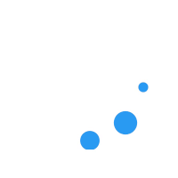
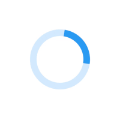

# Loaders Themelet

[](https://badge.fury.io/js/loaders-themelet)

A themelet providing eight alternative loaders for Liferay 7.x, based on the [Single Element CSS Spinners](https://projects.lukehaas.me/css-loaders/) project created by [Luke Hass](https://lukehaas.me/).

 







## Install

Go to your theme's root folder and type:
```bash
gulp extend
```
Choose _Themelet_ :
```
? What kind of theme asset would you like to extend? 
  Base theme 
❯ Themelet 
```
Choose _Search npm registry_ :
```
? Where would you like to search for themelets? 
  Search globally installed npm modules (development purposes only) 
❯ Search npm registry (published modules) 
```
Search for _loaders-themelet_ :
```
? Search npm for themelets: loaders-themelet
```
> If you have an error, try `npm audit fix` and retry installation from the beginning 

Press space to select it :
```
? Select a themelet 
❯◉ loaders-themelet
```

## Usage

Use loader number 8 with default color:  

```
@include loader8;
```

Use loader number 8 with custom color:  

```
@include loader8 ($color: red);
```

The mixins `loader2` and `loader3` accept an optional third argument for background color:

```
@include loader2 ($color: red, $background-color: grey);
```

Loaders index:

| Mixin     | Loader                       |
|:---------:|:---------------------------: |
| `loader1` |  |
| `loader2` |  |
| `loader3` |  |
| `loader4` |  |
| `loader5` |  |
| `loader6` |  |
| `loader7` |  |
| `loader8` |  |

## License

[MIT](LICENSE)
